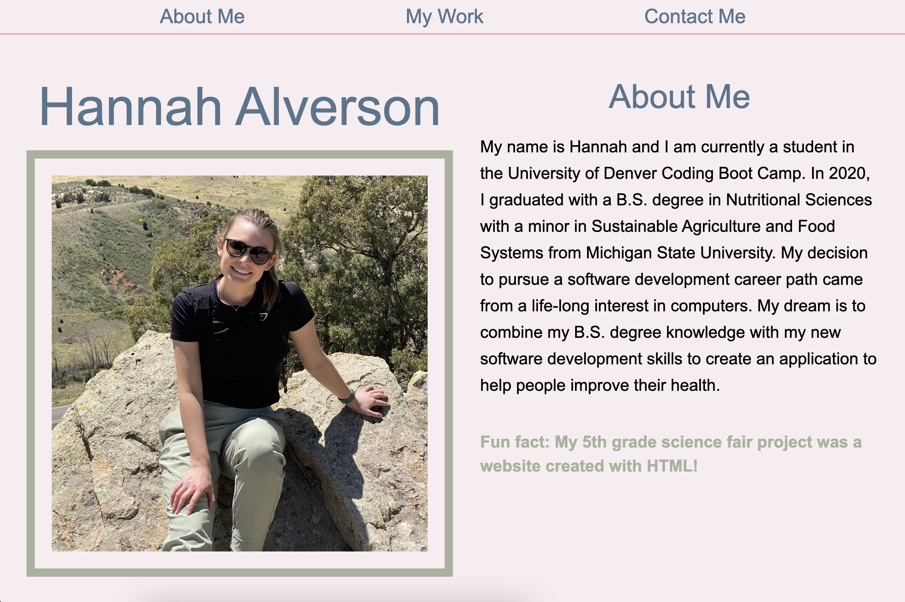

# Professional Portfolio: hannah-portfolio

Hannah Alverson's Professional Portfolio

---

## Description

This professional portfolio was built to showcase all of the applications that I have created throughout my career. As of now, I am still a student at the DU Coding Boot Camp, so I don't have many deployed applications. However, I am consistently working on new projects that will be added as they are completed.

This portfolio was built using only HTML and CSS, but will be updated with more languages and funtions as my coding skills improve.

### Main Content

A summarized list of the main content in the portfolio:

- Navigation bar to nagivate to specifc areas of the webpage.
- An "About Me" section that includes a recent photo and a description about myself.
- A section dedicated to my work showcasing 3 of my deployed applications.
- A "Contact Me" section that includes a contact form and links to my social media pages.

### Skills Learned/ Improved

Here is a list of some skills I learned and/or improved throughout this project:

- Using HTML sematic elements to help organize my webpage.
- Creating forms, navigation bars, and social media icons in HTML.
- Styling with CSS such as:
  - Flexbox
  - Media Query
  - Content spacing
  - Matching color scheme
- HTML and CSS sytanx

Tools used to complete this project:

- VS Code
- Terminal
- Chrome Dev Tools
- GitHub

## Usage

This portfolio is mainly used to showcase all of my current deployed applications to hiring companies. The goal is to have these companies look at my portfolio to see my capabilites and skillsets to show that I am a good candidate for the open position.

### Links

[Link]() to deployed website.

[Link](https://github.com/alverson98/hannah-portfolio) to code repository.

## Credits

I recieved guidance and tips from the instructional staff, TA's, and Students from the University of Denver Coding Boot Camp.
